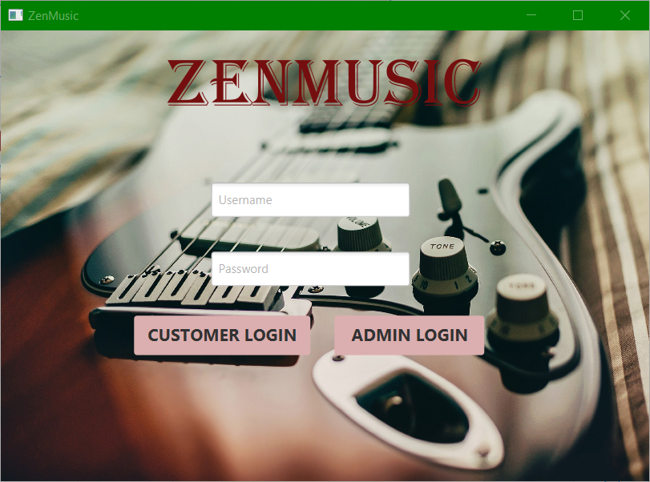

# Inventory of Musical Instruments

Inventory of Musical Instruments is a DBMS which is created for the various musical instruments which are present in the market. The Database will consist of different types of Musical instruments like Electronic Keyboard, Guitar, Drums and many more. The Database will consist the name of the musical instrument, brand and model number. It will give a clear view to the users.The System will consist two logins, Customers and Admin.
The Admin will be able to manage details of the musical instruments by perform sql operations such as insert, update and delete.
The Client will be able to view all the musical instruments which are available in this inventory.
 

## Technologies
- [Java] - widely used object-oriented language, the core of our system
- [JavaFX] - Java user interface library
- [MySQL] - data storage solution

## Tools
- [IntelliJ IDEA]
- [XAMPP]
- [Scene Builder] 

## Screenshots

### IMIS Login Page

### IMIS Admin Insert Page

### IMIS Admin Update Page

### IMIS Admin Delete Page

### IMIS Customer Page

